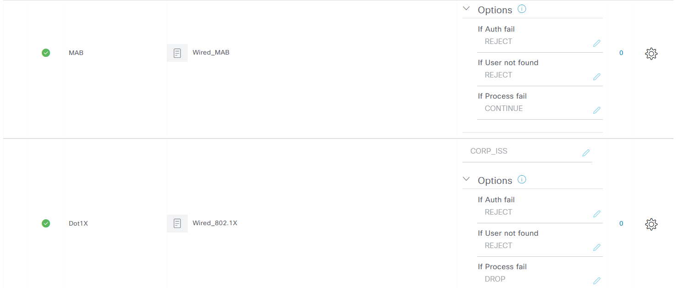
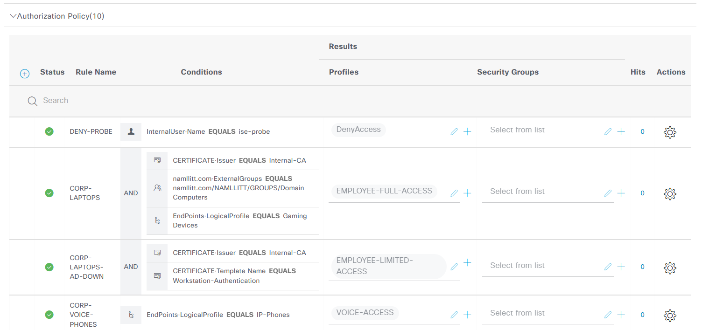
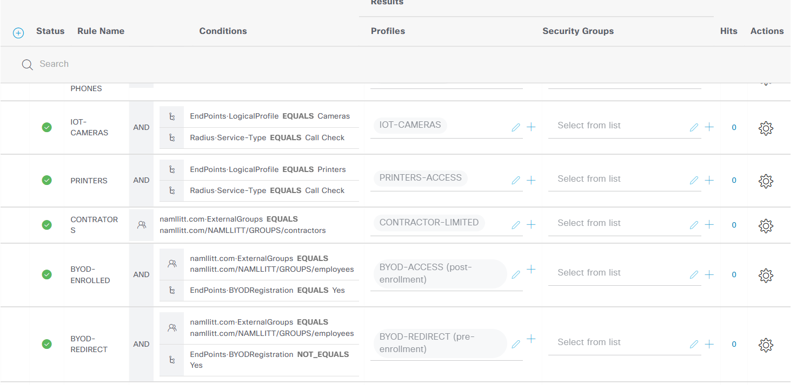
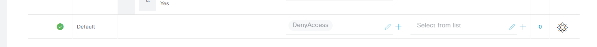
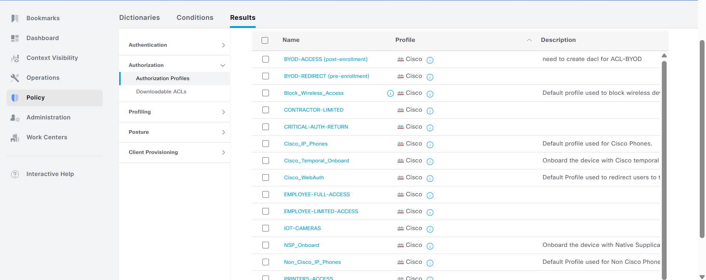
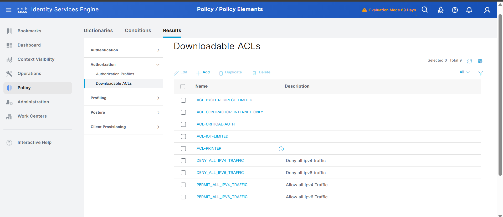
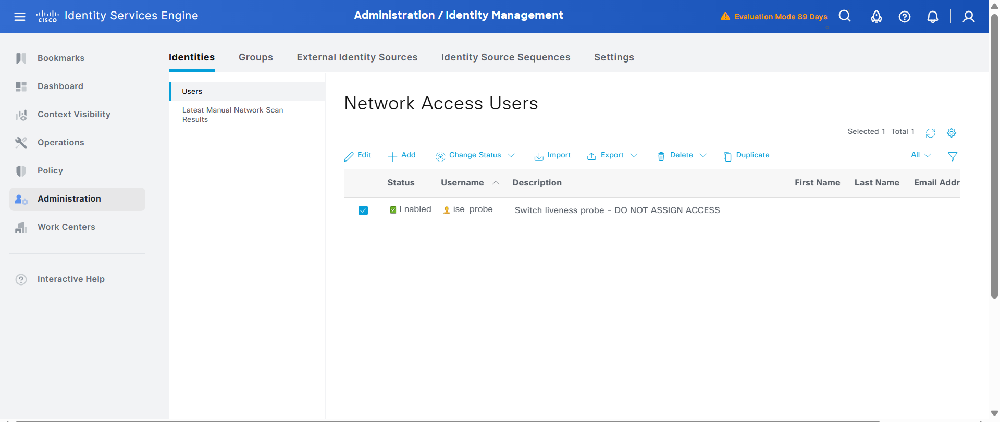

# 06 — Lab Build (real environment)

This is the actual config from the home-lab build of the design described in docs 01–05. Two ISE PSN nodes plus one access switch, wired against a small AD/DNS/NTP environment.

It is **sanitized for a public repo**:

- Real hostname / domain replaced with `LAB-*` and `lab.example.com`.
- Real IP addressing swapped:
  - Server / management subnet → `192.0.2.0/24` (RFC 5737 TEST-NET-1)
  - VLAN SVIs → `10.10.x.0/24`
- Shared secrets and ISE encryption keys are placeholders (`REPLACE_WITH_KEY1`, etc.).

The full cleaned switch config lives in `configs/lab-build/lab-switch-running-config.ios`. This doc walks through it and the ISE node configs, with notes on what was cleaned up vs the original lab build and why.

---

## Topology

```
                +------------------+    +------------------+
                |  ISE-PSN-01      |    |  ISE-PSN-02      |
                |  192.0.2.244/24  |    |  192.0.2.245/24  |
                +--------+---------+    +---------+--------+
                         |                        |
                         +------------+-----------+
                                      |
                              +-------+--------+
                              |  LAB-SWITCH    |
                              |  Vlan1 mgmt    |
                              |  192.0.2.2/24  |
                              +----------------+
                                      |
                            access-port range
                                      |
                              +-------+--------+
                              |  Test clients  |
                              |  (corp, IoT,   |
                              |   contractor)  |
                              +----------------+

   Shared services on the management subnet:
     - DNS / NTP / AD :  192.0.2.177
     - Default gateway:  192.0.2.1
```

VLANs in use:

| VLAN | Name | SVI |
|---|---|---|
| 1 | MGMT | 192.0.2.2/24 |
| 10 | EMPLOYEES | 10.10.10.1/24 |
| 15 | VOICE | 10.10.15.1/24 |
| 20 | IOT | 10.10.20.1/24 |
| 25 | PRINTERS | 10.10.25.1/24 |
| 30 | CONTRACTOR | 10.10.30.1/24 |
| 35 | BYOD | 10.10.35.1/24 |
| 998 | CRITICAL_VOICE | 10.10.198.1/24 |
| 999 | CRITICAL_DATA | 10.10.199.1/24 |

---

## ISE PSN configs

Both PSNs are configured nearly identically. Differences: `hostname`, management `ip address`. The configs below come from the ISE CLI, not IOS — same vibe, slightly different syntax.

### ISE-PSN-01

```text
interface GigabitEthernet 0
 ip address 192.0.2.244 255.255.255.0
 ipv6 enable
 ipv6 address autoconfig
!
hostname ISE-PSN-01
ip default-gateway 192.0.2.1
ip domain-name lab.example.com
ip name-server 192.0.2.177
ntp server 192.0.2.177
icmp echo on
ipv6 enable
logging loglevel 6
clock timezone UTC
!
password-policy
 digit-required
 lower-case-required
 min-password-length         8
 no-previous-password
 no-username
 password-expiration-days    45
 password-expiration-enabled
 password-lock-enabled
 password-lock-retry-count   3
 password-lock-timeout       15
 upper-case-required
!
service sshd enable
service sshd encryption-algorithm aes128-ctr aes128-gcm-openssh.com aes256-ctr aes256-gcm-openssh.com chacha20-poly1305-openssh.com
service sshd mac-algorithm hmac-sha1 hmac-sha2-256 hmac-sha2-512
service sshd host-key host-rsa
service ssh host-key-algorithm rsa-sha2-512 rsa-sha2-256 ssh-rsa
service cache enable hosts ttl 180
!
cdp run GigabitEthernet 0
cdp holdtime 180
cdp timer 60
!
conn-limit cl 5 port 9061
conn-limit cl1 30 port 9060
```

### ISE-PSN-02

Identical to PSN-01 except:

```text
interface GigabitEthernet 0
 ip address 192.0.2.245 255.255.255.0
hostname ISE-PSN-02
```

Everything else (password policy, SSH ciphers, NTP, etc.) is the same — keep both PSNs configured the same so cluster behavior is predictable.

---

## Switch config

The full cleaned config: [`configs/lab-build/lab-switch-running-config.ios`](../configs/lab-build/lab-switch-running-config.ios).

This walkthrough hits the highlights — for the actual deployable text, paste from the file above.

### AAA + RADIUS

```cisco
aaa new-model
aaa group server radius ISE-GROUP
 server name ISE-PSN-01
 server name ISE-PSN-02
 ip radius source-interface Vlan1
 deadtime 15
!
aaa server radius dynamic-author
 client 192.0.2.244 server-key REPLACE_WITH_KEY1
 client 192.0.2.245 server-key REPLACE_WITH_KEY2
 auth-type any
!
radius server ISE-PSN-01
 address ipv4 192.0.2.244 auth-port 1812 acct-port 1813
 timeout 5
 retransmit 2
 automate-tester username ise-probe probe-on
 key REPLACE_WITH_KEY1
!
radius server ISE-PSN-02
 address ipv4 192.0.2.245 auth-port 1812 acct-port 1813
 timeout 5
 retransmit 2
 automate-tester username ise-probe probe-on
 key REPLACE_WITH_KEY2
```

`automate-tester` is the active liveness probe — switch sends a fake auth every 60 seconds against an internal-only `ise-probe` user. ISE responds Access-Reject (no policy matches), but the response itself proves the server is alive. See `docs/03-ise-configuration.md` for the probe user setup.

### Class-maps

The conditions IBNS 2.0 uses to pick which event-action to run:

```cisco
class-map type control subscriber match-all AAA_SVR_DOWN_AUTHD_HOST
 match result-type aaa-server down
 match authorization-status authorized
!
class-map type control subscriber match-all AAA_SVR_DOWN_UNAUTHD_HOST
 match result-type aaa-server down
 match authorization-status unauthorized
!
class-map type control subscriber match-all DOT1X_FAILED
 match method dot1x
 match result-type method dot1x authoritative
!
class-map type control subscriber match-all DOT1X_NO_RESP
 match method dot1x
 match result-type method dot1x agent-not-found
!
class-map type control subscriber match-all MAB_FAILED
 match method mab
 match result-type method mab authoritative
!
class-map type control subscriber match-all IN_CRITICAL_AUTH
 match activated-service-template CRITICAL_AUTH_ACCESS
!
class-map type control subscriber match-none NOT_IN_CRITICAL_AUTH
 match activated-service-template CRITICAL_AUTH_ACCESS
```

Note `NOT_IN_CRITICAL_AUTH` uses `match-none` plus the *same* condition as `IN_CRITICAL_AUTH`. That makes them true logical opposites. See "Cleanup notes" below.

### Service templates

Two flavors: data-side and voice-side critical-auth.

```cisco
service-template CRITICAL_AUTH_ACCESS
 description Data-side critical-auth, applied when RADIUS is unreachable
 access-group ACL-CRITICAL-AUTH
 vlan 999
 inactivity-timer 60
!
service-template CRITICAL_AUTH_VOICE
 description Voice-side critical-auth, phones keep working during outage
 voice vlan 998
```

The voice template now uses `voice vlan` (not `vlan`) so phones get placed on the voice VLAN side of the dot1q trunk during an outage, not on a data VLAN.

### Policy-map

The state machine — see `docs/02-ibns2-policy-explained.md` for a line-by-line walkthrough. Same shape as in that doc.

### Access ports

```cisco
interface range FastEthernet1/1, FastEthernet1/4 - 8
 description === User Access ===
 switchport mode access
 switchport access vlan 10
 switchport voice vlan 15
 switchport nonegotiate
 spanning-tree portfast edge
 spanning-tree bpduguard enable
 storm-control broadcast level pps 1k
 storm-control multicast level pps 1k
 access-session closed
 access-session port-control auto
 mab
 dot1x pae authenticator
 dot1x timeout tx-period 7
 authentication periodic
 authentication timer reauthenticate server
 ip dhcp snooping limit rate 20
 service-policy type control subscriber DOT1X_MAB_POLICY
```

`access-session closed` puts these ports in Closed Mode. Production-ish.

---

## Cleanup notes — what changed vs the original dump

These are real fixes against the configs as they were copied off the lab gear, with reasons.

### 1. `match result-type aaa-timeout` → `match result-type aaa-server down`

The original class-maps used `aaa-timeout`, which only fires on a single RADIUS timeout. The intended behavior is "the switch's dead-detection has decided the server is gone, fall to critical-auth," which matches `aaa-server down`. Without this change, brief network blips can knock sessions into critical mode.

### 2. `NOT_IN_CRITICAL_AUTH` was wrong

Original:

```cisco
class-map type control subscriber match-all NOT_IN_CRITICAL_AUTH
 match authorization-status authorized
```

That matches *every* authorized session, not "any authorized session that is not currently in critical auth." The fixed version:

```cisco
class-map type control subscriber match-none NOT_IN_CRITICAL_AUTH
 match activated-service-template CRITICAL_AUTH_ACCESS
```

`match-none` inverts the inner match. Now `IN_CRITICAL_AUTH` and `NOT_IN_CRITICAL_AUTH` are true opposites, which is what the `event aaa-available` logic needs.

### 3. `CRITICAL_AUTH_VOICE` was a data template wearing a voice label

Original:

```cisco
service-template CRITICAL_AUTH_VOICE
 access-group ACL-CRITICAL-AUTH
 vlan 998
 inactivity-timer 60
```

Phones share a port with a data device — the switch separates voice and data via the dot1q voice VLAN, not by replacing the data VLAN. Cleaned up:

```cisco
service-template CRITICAL_AUTH_VOICE
 voice vlan 998
```

Now the data side stays on `CRITICAL_AUTH_ACCESS` (VLAN 999) and the voice side rides VLAN 998 during an outage. Phones can keep registering.

### 4. NTP made consistent

Original switch pointed at `pool.ntp.org` directly while the PSNs pointed at `192.0.2.177` (internal). Cleaned up so all three lock onto the internal NTP source first with public pool servers as fallback. Time skew in lab gear is the source of subtle ISE / AD certificate failures.

### 5. Cosmetic

- Repeated identical interface stanzas collapsed into a `range` block.
- Stripped trailing whitespace.
- Normalized the `!` separator placement so each section has one above/below it instead of randomly placed extras.
- Grouped related sections (AAA, class-maps, service templates, policy-map, ports, SVIs, ACLs, NTP) so the config reads top-to-bottom.

---

## ISE screenshots

Captured from the lab ISE admin UI. Filenames are placeholders — feel free to rename them to match the area they show (e.g. `02-network-devices.png`, `03-policy-set.png`, `04-authz-profile-employee.png`).











---

## Things to add later

- Captioned screenshot rename so each image gets a meaningful name and section.
- A short "test results" file (`lab/results-<date>.md`) walking through `lab/test-plan.md` against this real build.
- An ISE backup export (sanitized) so the policy set is reproducible.
