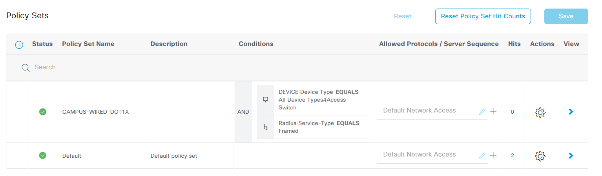
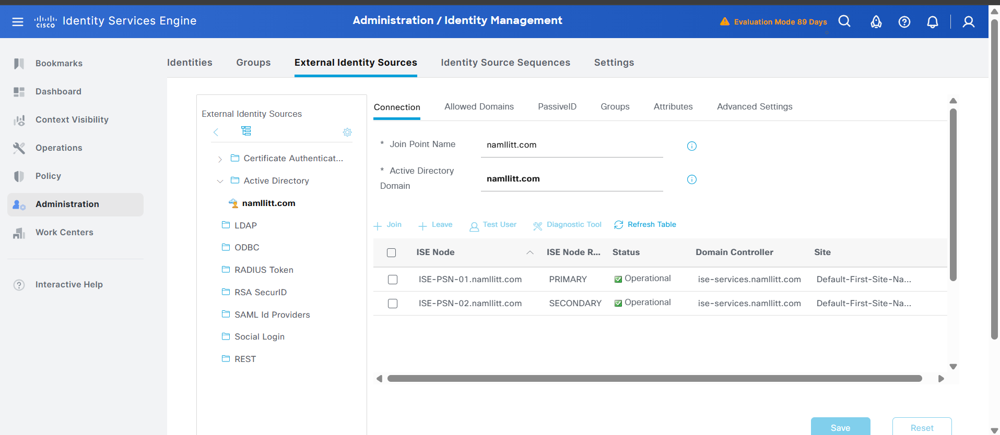

!--------------------------------------ISE-PSN-01--------------------------------------
!
interface GigabitEthernet 0
 ip address 192.168.0.244 255.255.255.0
 ipv6 enable
 ipv6 address autoconfig
!
ntp server 192.168.0.177
hostname ISE-PSN-01
icmp echo on
ip domain-name namllitt.com
ip default-gateway 192.168.0.1
ip name-server 192.168.0.177
ipv6 enable
logging loglevel 6
password-policy
 digit-required
 lower-case-required
 min-password-length         8
 no-previous-password
 no-username
 password-expiration-days    45
 password-expiration-enabled
 password-lock-enabled
 password-lock-retry-count   3
 password-lock-timeout       15
 upper-case-required
!
service sshd enable
service sshd encryption-algorithm aes128-ctr aes128-gcm-openssh.com aes256-ctr aes256-gcm-openssh.com chacha20-poly1305-openssh.com
service sshd mac-algorithm hmac-sha1 hmac-sha2-256 hmac-sha2-512
service sshd host-key host-rsa
service ssh host-key-algorithm rsa-sha2-512 rsa-sha2-256 ssh-rsa
service cache enable hosts ttl 180
cdp holdtime 180
cdp timer 60
cdp run GigabitEthernet 0
clock timezone UTC
conn-limit cl 5 port 9061
conn-limit cl1 30 port 9060
!
!-----------------------------------------ISE-PSN-02----------------------------------
!
interface GigabitEthernet 0
 ip address 192.168.0.245 255.255.255.0
 ipv6 enable
 ipv6 address autoconfig
!
ntp server 192.168.0.177
hostname ISE-PSN-02
icmp echo on
ip domain-name namllitt.com
ip default-gateway 192.168.0.1
ip name-server 192.168.0.177
ipv6 enable
logging loglevel 6
password-policy
 digit-required
 lower-case-required
 min-password-length         8
 no-previous-password
 no-username
 password-expiration-days    45
 password-expiration-enabled
 password-lock-enabled
 password-lock-retry-count   3
 password-lock-timeout       15
 upper-case-required
!
service sshd enable
service sshd encryption-algorithm aes128-ctr aes128-gcm-openssh.com aes256-ctr aes256-gcm-openssh.com chacha20-poly1305-openssh.com
service sshd mac-algorithm hmac-sha1 hmac-sha2-256 hmac-sha2-512
service sshd host-key host-rsa
service ssh host-key-algorithm rsa-sha2-512 rsa-sha2-256 ssh-rsa
service cache enable hosts ttl 180
cdp holdtime 180
cdp timer 60
cdp run GigabitEthernet 0
clock timezone UTC
conn-limit cl 5 port 9061
conn-limit cl1 30 port 9060
!
!---------------------------NAMLLITT-SWITCH----------------------------
!
!
!
no service pad
service timestamps debug datetime msec
service timestamps log datetime msec
service password-encryption
!
hostname NAMLLITT-SWITCH
!
boot-start-marker
boot-end-marker
!
no logging console
!
aaa new-model
!
aaa group server radius ISE-GROUP
 server name ISE-PSN-01
 server name ISE-PSN-02
 ip radius source-interface Vlan1
 deadtime 15      
!   
aaa authentication dot1x default group ISE-GROUP
aaa authorization network default group ISE-GROUP 
aaa authorization auth-proxy default group ISE-GROUP 
aaa accounting update newinfo periodic 2880
aaa accounting identity default start-stop group ISE-GROUP
aaa accounting network default start-stop group ISE-GROUP
!
!
!
!
!
aaa server radius dynamic-author
 client 192.168.0.244 server-key !--insert key1--!
 client 192.168.0.245 server-key !--insert key2--!
 auth-type any
!
aaa session-id common
system mtu routing 1500 
!
!         
ip dhcp snooping vlan 100
no ip dhcp snooping information option
ip domain-name NAMLLITT-SWITCH.namllitt.com
ip name-server 192.168.0.177
ip device tracking probe auto-source
ip device tracking probe delay 10
vtp domain VTP.NAMLLITT.LAN
vtp mode off
!
!
!
!
!
authentication critical recovery delay 2000
!
archive
 log config
  logging enable
  logging size 1000
  notify syslog contenttype plaintext
  hidekeys
dot1x system-auth-control
dot1x critical eapol
service-template webauth-global-inactive
 inactivity-timer 3600 
service-template DEFAULT_CRITICAL_VOICE_TEMPLATE
service-template DEFAULT_LINKSEC_POLICY_SHOULD_SECURE
service-template DEFAULT_LINKSEC_POLICY_MUST_SECURE
service-template CRITICAL_AUTH_VOICE
 description Voice-side critical-auth: phones keep working during outage
 access-group ACL-CRITICAL-AUTH
 vlan 998
 inactivity-timer 60 
service-template CRITICAL_AUTH_ACCESS
 description Data-side critical-auth: applied when RADIUS is unreachable
 access-group ACL-CRITICAL-AUTH
 vlan 999
 inactivity-timer 60 
!
spanning-tree mode rapid-pvst
spanning-tree extend system-id
!
alarm profile defaultPort
 alarm not-operating 
 syslog not-operating 
 notifies not-operating 
!
!
!
vlan internal allocation policy ascending
!
vlan 10
 name EMPLOYEES
!
vlan 15
 name VOICE
!
vlan 20
 name IOT
!
vlan 25
 name PRINTERS
!
vlan 30
 name CONTRACTOR
!         
vlan 35
 name BYOD
!
vlan 40
 name CRITICAL_VOICE
!
vlan 45
 name CRITICAL_DATA
!
lldp run
class-map type control subscriber match-all AAA_SVR_DOWN_AUTHD_HOST
 match result-type aaa-timeout
 match authorization-status authorized
!
class-map type control subscriber match-all AAA_SVR_DOWN_UNAUTHD_HOST
 match result-type aaa-timeout
 match authorization-status unauthorized
!
class-map type control subscriber match-all DOT1X
 match method dot1x
!
class-map type control subscriber match-all DOT1X_FAILED
 match method dot1x
 match result-type method dot1x authoritative
!
class-map type control subscriber match-all DOT1X_NO_RESP
 match method dot1x
 match result-type method dot1x agent-not-found
!
class-map type control subscriber match-all IN_CRITICAL_AUTH
 match activated-service-template CRITICAL_AUTH_ACCESS
!
class-map type control subscriber match-any IN_CRITICAL_VLAN
class-map type control subscriber match-all MAB
 match method mab
!
class-map type control subscriber match-all MAB_FAILED
 match method mab
 match result-type method mab authoritative
!
class-map type control subscriber match-all NOT_IN_CRITICAL_AUTH
 match authorization-status authorized
!
class-map type control subscriber match-none NOT_IN_CRITICAL_VLAN
!
!
!
policy-map type control subscriber DOT1X_MAB_POLICY
 event session-started match-all
  10 class always do-until-failure
   10 authenticate using dot1x priority 10
 event authentication-failure match-first
  10 class AAA_SVR_DOWN_UNAUTHD_HOST do-until-failure
   10 activate service-template CRITICAL_AUTH_ACCESS
   20 activate service-template CRITICAL_AUTH_VOICE
   30 authorize
   40 pause reauthentication
  20 class AAA_SVR_DOWN_AUTHD_HOST do-until-failure
   10 pause reauthentication
   20 authorize
  30 class DOT1X_FAILED do-until-failure
   10 terminate dot1x
   20 authenticate using mab priority 20
  40 class DOT1X_NO_RESP do-until-failure
   10 terminate dot1x
   20 authenticate using mab priority 20
  50 class MAB_FAILED do-until-failure
   10 terminate mab
   20 authentication-restart 60
 event aaa-available match-all
  10 class IN_CRITICAL_AUTH do-until-failure
   10 clear-session
  20 class NOT_IN_CRITICAL_AUTH do-until-failure
   10 resume reauthentication
 event agent-found match-all
  10 class always do-until-failure
   10 terminate mab
   20 authenticate using dot1x priority 10
 event violation match-all
  10 class always do-all
   10 restrict
!
!
!
!
!
interface FastEthernet1/1
 description === User Access ===
 switchport access vlan 10
 switchport mode access
 switchport nonegotiate
 switchport voice vlan 15
 authentication periodic
 authentication timer reauthenticate server
 access-session closed
 access-session port-control auto
 mab
 dot1x pae authenticator
 dot1x timeout tx-period 7
 storm-control broadcast level pps 1k
 storm-control multicast level pps 1k
 spanning-tree portfast edge
 spanning-tree bpduguard enable
 service-policy type control subscriber DOT1X_MAB_POLICY
 ip dhcp snooping limit rate 20
!
interface FastEthernet1/4
 description === User Access ===
 switchport access vlan 10
 switchport mode access
 switchport nonegotiate
 switchport voice vlan 15
 authentication periodic
 authentication timer reauthenticate server
 access-session closed
 access-session port-control auto
 mab
 dot1x pae authenticator
 dot1x timeout tx-period 7
 storm-control broadcast level pps 1k
 storm-control multicast level pps 1k
 spanning-tree portfast edge
 spanning-tree bpduguard enable
 service-policy type control subscriber DOT1X_MAB_POLICY
 ip dhcp snooping limit rate 20
!
interface FastEthernet1/5
 description === User Access ===
 switchport access vlan 10
 switchport mode access
 switchport nonegotiate
 switchport voice vlan 15
 authentication periodic
 authentication timer reauthenticate server
 access-session closed
 access-session port-control auto
 mab
 dot1x pae authenticator
 dot1x timeout tx-period 7
 storm-control broadcast level pps 1k
 storm-control multicast level pps 1k
 spanning-tree portfast edge
 spanning-tree bpduguard enable
 service-policy type control subscriber DOT1X_MAB_POLICY
 ip dhcp snooping limit rate 20
!
interface FastEthernet1/6
 description === User Access ===
 switchport access vlan 10
 switchport mode access
 switchport nonegotiate
 switchport voice vlan 15
 authentication periodic
 authentication timer reauthenticate server
 access-session closed
 access-session port-control auto
 mab
 dot1x pae authenticator
 dot1x timeout tx-period 7
 storm-control broadcast level pps 1k
 storm-control multicast level pps 1k
 spanning-tree portfast edge
 spanning-tree bpduguard enable
 service-policy type control subscriber DOT1X_MAB_POLICY
 ip dhcp snooping limit rate 20
!
interface FastEthernet1/7
 description === User Access ===
 switchport access vlan 10
 switchport mode access
 switchport nonegotiate
 switchport voice vlan 15
 authentication periodic
 authentication timer reauthenticate server
 access-session closed
 access-session port-control auto
 mab
 dot1x pae authenticator
 dot1x timeout tx-period 7
 storm-control broadcast level pps 1k
 storm-control multicast level pps 1k
 spanning-tree portfast edge
 spanning-tree bpduguard enable
 service-policy type control subscriber DOT1X_MAB_POLICY
 ip dhcp snooping limit rate 20
!
interface FastEthernet1/8
 description === User Access ===
 switchport access vlan 10
 switchport mode access
 switchport nonegotiate
 switchport voice vlan 15
 authentication periodic
 authentication timer reauthenticate server
 access-session closed
 access-session port-control auto
 mab      
 dot1x pae authenticator
 dot1x timeout tx-period 7
 storm-control broadcast level pps 1k
 storm-control multicast level pps 1k
 spanning-tree portfast edge
 spanning-tree bpduguard enable
 service-policy type control subscriber DOT1X_MAB_POLICY
 ip dhcp snooping limit rate 20
!
interface Vlan1
 description MGMT_192.168.0.2
 ip address 192.168.0.2 255.255.255.0
!
interface Vlan10
 description EMPLOYEES_192.168.10.1_24
 ip address 192.168.10.1 255.255.255.0
!
!
interface Vlan15
 description VOICE_192.168.15.1_24
 ip address 192.168.15.1 255.255.255.0
!
interface Vlan20
 description IOT_192.168.20.1_24
 ip address 192.168.20.1 255.255.255.0
!
interface Vlan25
 description PRINTERS_192.168.25.1_24
 ip address 192.168.25.1 255.255.255.0
!
interface Vlan30
 description CONTRACTOR_192.168.30.1_24
 ip address 192.168.30.1 255.255.255.0
!
interface Vlan35
 description BYOD_192.168.35.1_24
 ip address 192.168.35.1 255.255.255.0
!
interface Vlan40
 description CRITICAL_VOICE_192.168.40.1_24
 ip address 192.168.40.1 255.255.255.0
!
interface Vlan45
 description CRITICAL_DATA_192.168.45.1_24
 ip address 192.168.45.1 255.255.255.0
!
ip http server
ip http secure-server
ip http secure-active-session-modules none
ip http active-session-modules none
ip ssh version 2
!
ip access-list extended ACL-CONTRACTOR
 remark --- Basic network services ---
 permit udp any any eq bootps
 permit udp any any eq domain
 permit udp any eq domain any
 remark --- Two internal apps that contractors need ---
 permit tcp any host 192.168.10.254 eq 443
 permit tcp any host 192.168.10.253 eq 443
 remark --- Block all access to internal user / infra subnets ---
 deny   ip any 192.168.1.0 0.0.255.255 log-input
 remark --- Everything else = internet ---
 permit ip any any
ip access-list extended ACL-CRITICAL-AUTH
 remark --- Allow essential infra while ISE is down ---
 permit udp any any eq bootps
 permit udp any any eq bootpc
 permit udp any any eq domain
 permit udp any eq domain any
 permit icmp any any
 remark --- Internal help portal (tells user about the outage) ---
 permit tcp any host 192.168.10.254 eq www
 permit tcp any host 192.168.10.253 eq 443
 remark --- Default deny with logging for post-mortem ---
 deny   ip any any log-input
ip access-list extended ACL-OPEN
 permit ip any any
ip access-list extended ACL-REDIRECT
 permit tcp any host 192.168.0.244 eq 8443
 permit tcp any host 192.168.0.244 eq 443
 permit tcp any host 192.168.0.244 eq 8905
 permit tcp any host 192.168.0.245 eq 8443
 permit tcp any host 192.168.0.245 eq 443
 permit tcp any host 192.168.0.245 eq 8905
 deny   ip any any
ip access-list extended ACL-WEBAUTH-REDIRECT
 remark --- Do NOT redirect infra traffic ---
 deny   udp any any eq domain
 deny   udp any any eq bootps
 remark --- Do NOT redirect traffic to ISE itself ---
 deny   ip any host 192.168.0.244
 deny   ip any host 192.168.0.245
 remark --- Redirect HTTP/HTTPS everywhere else ---
 permit tcp any any eq www
 permit tcp any any eq 443

radius-server attribute 6 on-for-login-auth
radius-server attribute 8 include-in-access-req
radius-server attribute 25 access-request include
radius-server attribute 31 mac format ietf upper-case
radius-server attribute 31 send nas-port-detail mac-only
radius-server dead-criteria time 5 tries 3
radius-server deadtime 15
!
radius server ISE-PSN-01
address ipv4 192.168.0.244 auth-port 1812 acct-port 1813
 timeout 5
 retransmit 2
 automate-tester username ise-probe probe-on
 key !--insert key--!
!
radius server ISE-PSN-02
 address ipv4 192.168.0.245 auth-port 1812 acct-port 1813
 timeout 5
 retransmit 2
 automate-tester username ise-probe probe-on
 key !--insert key--!
!
line con 0
 logging synchronous
line vty 0 4
 logging synchronous
 transport input ssh
 transport output ssh
line vty 5 15
 transport input ssh
!
ntp source Vlan1
ntp server 1.north-america.pool.ntp.org prefer
ntp server 3.north-america.pool.ntp.org
ntp server 0.north-america.pool.ntp.org
ntp server 2.north-america.pool.ntp.org
ntp server pool.ntp.org
end
!
!-------------------------ISE Screenshots---------------------

